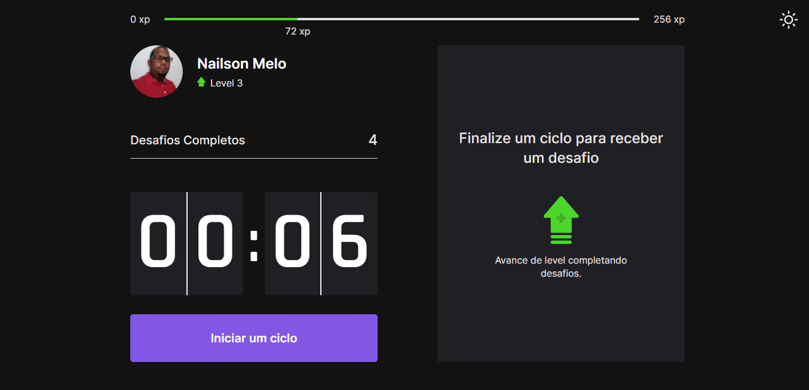
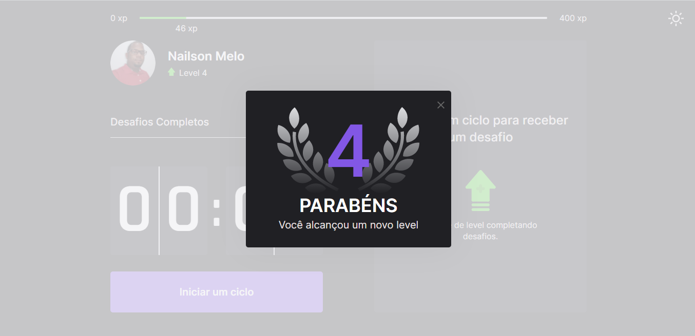
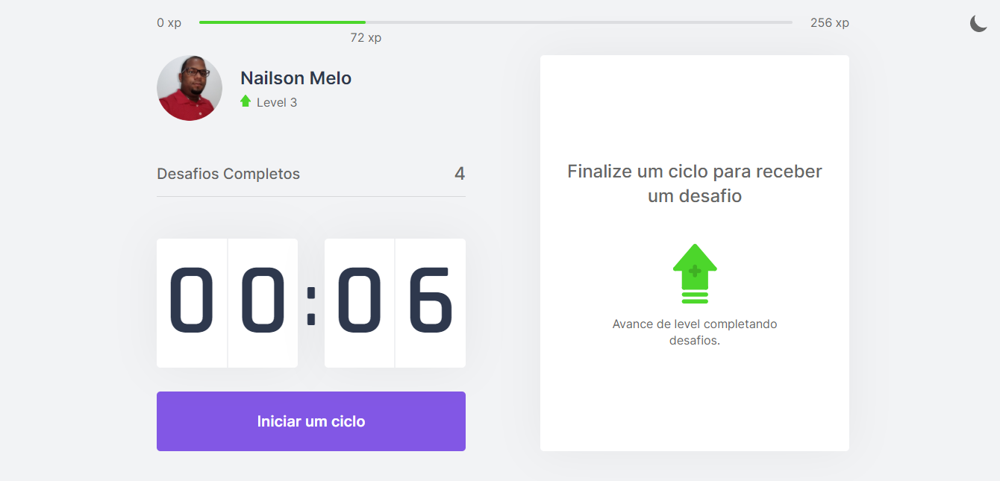
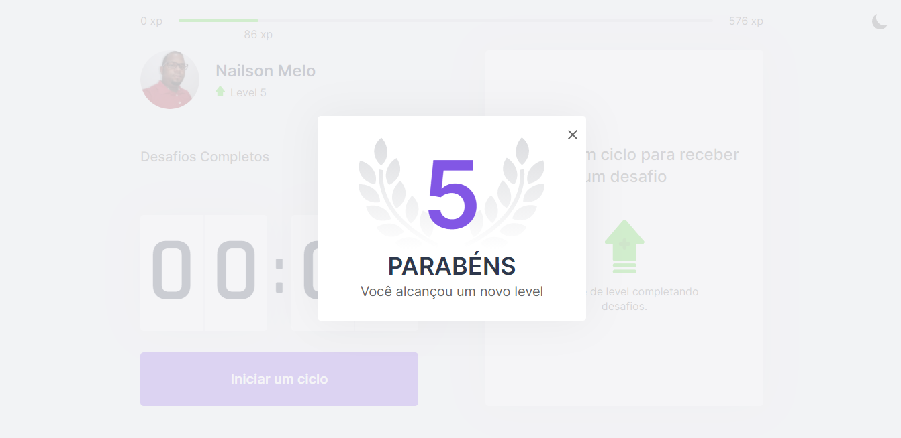
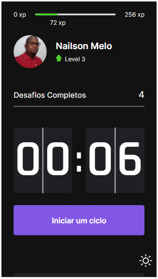
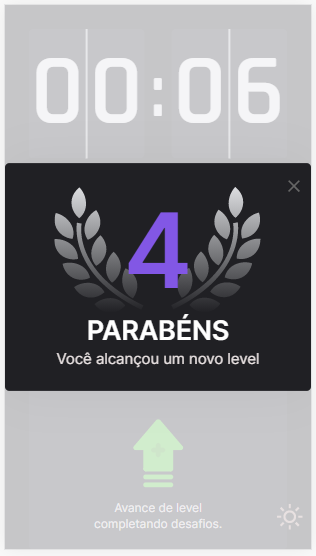
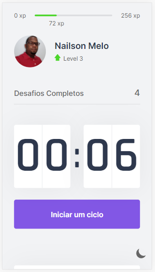
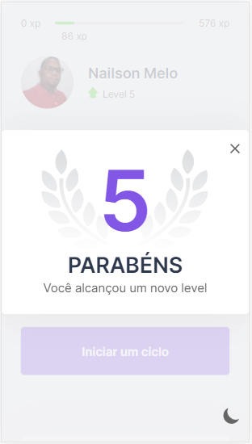

## *** Move.It *** <h2>Developed during Next Level Week - RocketSeat</h2>

### What was used for implementation?

* Next.JS
* React.JS ⚛️
* TypeScript

## Screens
| | | 
|:-------------------------:|:-------------------------:|
|  Home Dark |   Home Dark Modal|
| Home Light| Home Light Modal |

## Screens mobile
| | | 
|:-------------------------:|:-------------------------:|
|   Home Dark Mobile |   Home Dark Mobile Modal | 
|   Home Light Mobile |   Home Light Mobile Modal | 

## Basic Setup

To run demo: clone repo and run `npm install || yarn install && npm run dev || yarn dev`
and open `http://localhost:3000`.

